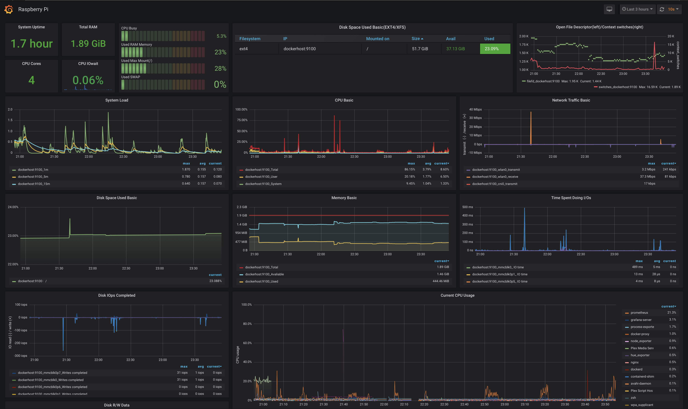
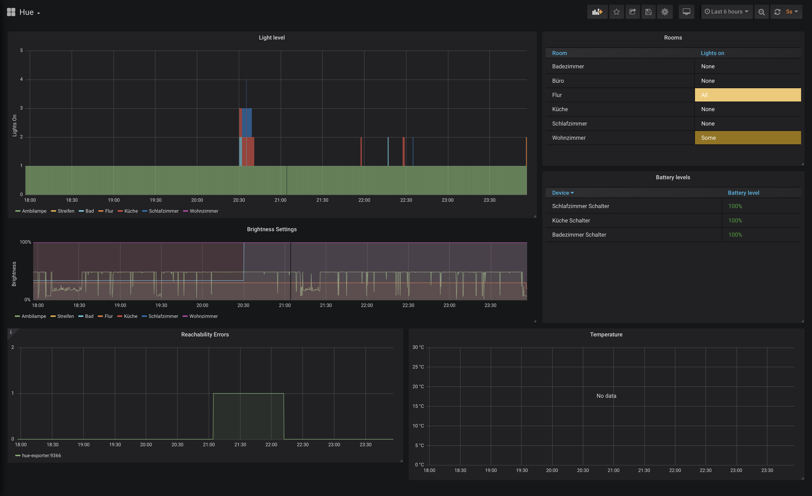
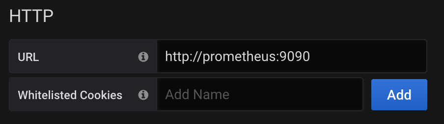

# Monitoring Smart Devices #

This project aims to provide essential monitoring for home automation items in my private home. It is supposed to be run on a Raspberry Pi and is currently run on a Raspberry Pi 4b with 2GB RAM. It utilizes docker-compose to describe the main components.

The project currently supports two grafana dashboards with various data exporters

* Philips Hue
* Raspberry Pi:
  * `Temperature Exporter` captures the CPU temperature of the Raspberry Pi.
  * `Node Exporter` is used to capture general information.
  * `Process Exporter` captures detailed information about running processes.

These data exporters provide metrics for a prometheus instance which itself is called by Grafana. Both Prometheus and Grafana are available to the user, so be careful to set up security mechanisms. The two exporters are not exposed outside the docker network.

For the Hue exporter to work, the Security Token needs to be set in the `hue-exporter-config.yml` file. The Raspberry Pi node data is exported via a common service but rather a docker service. This is not recommended but done to keep everything simple.

Both the `node exporter` and the `process exporter` are run as system services. This is in contrast to all the other listed tools, which are run as dockerized applications. The reason for this is, that these applications provide improved information, when they are not run in a containerized environment. For the the `process exporter` there is no ARM support yet.

The Hue dashboard provides a basic overview over turned on lights and the battery level of sensors.

## Available services ##

The Prometheus service can be reached via [http://localhost:4000](http://localhost:4000), while the Grafana Dashboards are available on  [http://localhost:3000](http://localhost:3000). Change localhost for the Raspeberry Pi's IP address if needed. The example Grafana Boards are placed in the [./grafana-boards](./grafana-boards/) folder and can be used as basic templates.

To declare the Prometheus data source in Grafana, the preferred method is to use the service's internal name and port. For this configuration the data source URL is `http://prometheus:9090`. For this, Docker's DNS capabilities are utilized.

